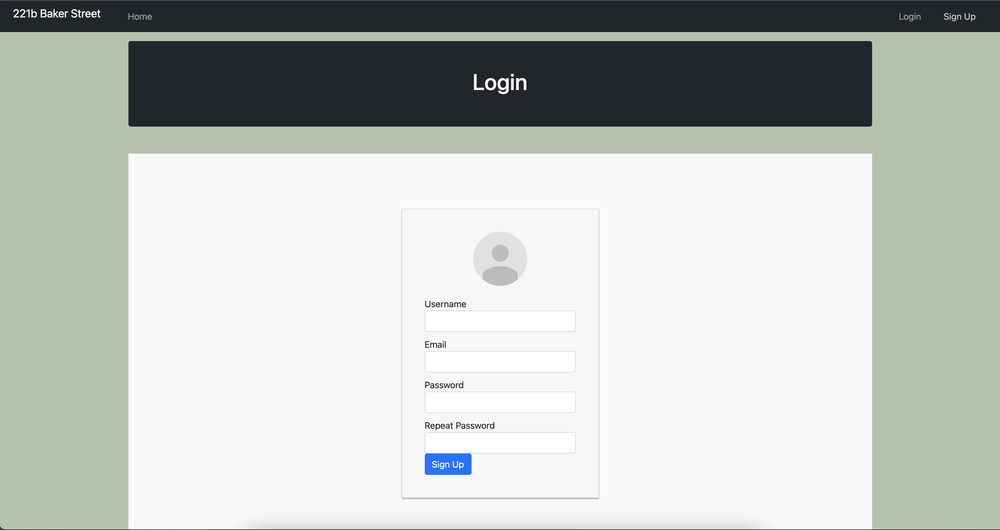

## Backery Project

#### Order backery items with admin panel

Backend for this project is published on https://github.com/cptc0ld/BackeryAppBackend

## Installation and Setup Instructions

## Install by Docker

    - docker-compose build   
    - docker-compose up
    
#### Install:

Clone down this repository. You will need `node` and `npm` installed globally on your machine.

Installation:

`npm install`

To Start Server:

`npm start`

To Visit App:

`localhost:3000/`

## Project Screen Shot(s)

#### Example:

